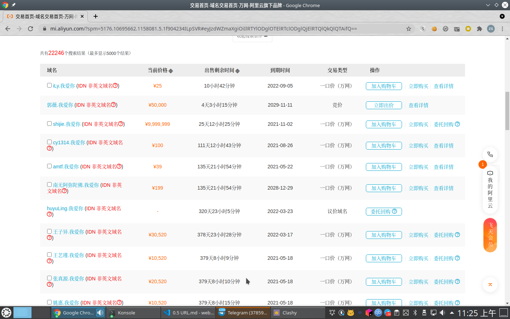

# URL 与 web 背景

## URL

什么是 URL？

> 统一资源定位符（英语：Uniform Resource Locator，缩写：URL；或称统一资源定位器、定位地址、URL地址[1]，俗称网页地址或简称网址）是因特网上标准的资源的地址（Address），如同在网络上的门牌。它最初是由蒂姆·伯纳斯-李发明用来作为万维网的地址，现在它已经被万维网联盟编制为因特网标准RFC 1738。

## URL 的组成

> 统一资源定位符的标准格式如下：
> `[协议类型]://[服务器地址]:[端口号]/[资源层级UNIX文件路径][文件名]?[查询]#[片段ID]`
> 
> 统一资源定位符的完整格式如下：
> `[协议类型]://[访问资源需要的凭证信息]@[服务器地址]:[端口号]/[资源层级UNIX文件路径][文件名]?[查询]#[片段ID]`
> 
> 其中`[访问凭证信息]`、`[端口号]`、`[查询]`、`[片段ID]`都属于选填项。

举个🌰

https://zsh2517.com/images/bg0.jpg

| 类别                   | 值            |
|----------------------|---------------|
| 协议类型               | `https`       |
| 服务器地址             | `zsh2517.com` |
| 资源层级 UNIX 文件路径 | `images/`     |
| 文件名                 | `bg0.jpg`     |

### 协议类型

如果没有说明，一般  web 相关的协议类型有两种， `HTTP` 和 `HTTPS`

而 `HTTP` 默认了端口是 80， `HTTPS` 默认了端口 443

例如 `p.zsh2517.com` 和 `zsh2517.com:9001` （`p.zsh2517.com` 上了 HTTPS，因此实际访问的是 443 端口）

### 服务器地址

#### 域名

##### 顶级域名

- 国家及地区双字代码顶级域（基于ISO-3166规定的国家/地区双字缩写代码）

比如 `.cn`, `.hk`, `.jp`, `.uk`

- 通用顶级域

比如 `.gov`(government), `.edu`(education), `.icu`(I see you，而不是 重症监护室), `.com`(commercial), `.net/network`(network), `org`(organization 非盈利机构) 等等

- 国际化顶级域名

[国际化域名](https://zh.wikipedia.org/wiki/%E5%9B%BD%E9%99%85%E5%8C%96%E5%9F%9F%E5%90%8D)

比如我国的有网址、网店、集团、中文网、中国、公司、网络、在线等

~~大型分手现场~~

顶级域名只是具有这些含义，而未必是一定要符合这个（比如我个人域名是 `zsh2517.com` 但是并没有商业行为）
.com 的辨识度要大于 .cn/.net，更大于其他的域名，商业机构不是很建议其他的

就比如我自己，很早之前，不止一次把 360 官网输入成 `360.com` 而当时是 `360.cn`

[相关链接](http://media.people.com.cn/n/2015/0205/c40606-26510676.html) 

而如果不是以宣传广度为目的，则可以选择更多的有特色的域名

比如 `.io`，因为具有了互联网相关的含义，本身是`英国英属印度洋领地`的地区域名，现在成了相当多的互联网机构的选择（比如 `github.io`），而 `cm` 是喀麦隆国家及地区顶级域的域名，在印象中，早期国内经常见到 `.cm` 站点

**域名 hack**

- [zhi.hu](zhi.hu)
- [ele.ma](ele.ma)
- [codeforc.es](codeforc.es)
- [men.ci](men.ci)
- [youtu.be](youtu.be)
- [goo.gl](goo.gl)

##### 二级域名

一般注册域名，是指选择一个顶级域名并且配上自己的二级域名

比如 `zsh2517.com`， `zsh2517` 是二级域名。

特殊的，对于一些机构相关的域名，比如 `edu`, `gov` 等，以此为顶级域名的一般是美国机构，国内一般是 `edu.cn`, `gov.cn` 等，这个时候按照规则自己选择的（比如 `hit.edu.cn` 可以算作是三级域名了）

##### 子域名

自己买的域名，其前缀可以自由分配。比如 `www.zsh2517.com`, `blog.zsh2517.com`, `p.zsh2517.com` 等，这种统称为子域名

（其中关于 `www.example.com` 和 `example.com`，二者并不是一种）

#### ip

ipv4/ipv6

#### hosts

通过修改 hosts 实现对于任意字符串访问

### 资源层级UNIX文件路径

就是一个目录，不再展开说明

### 文件名

文件名这里有一个特殊的点：不一定有文件名

比如 

`http://blog.zsh2517.com`

其目录和文件名都是空的

默认页面， `index`, `default` 等名称，配合常见的页面的扩展名 `html`, `htm`, `php`, `asp(x)`，比如 `index.html` 会作为直接访问目录的默认页面。

### 查询

格式为 `xxxx?key1=val1&key2=val2`

### 片段 ID

这里的 ID 对应的就是 HTML 里面标签的属性 `id`（叫做 hashtag）

比如 `<h2 id="grammar">JavaScript 语法</h2>`

当页面带上 `#XX` 载入的时候，会跳转到对应的位置（默认行为）

`hashtag` 改变的时候，不会影响到页面重新加载，但是可以通过一些特殊手段进行操作。

一些框架，比如 `vue` 会用 `hashtag` 作为页面路径标识。

