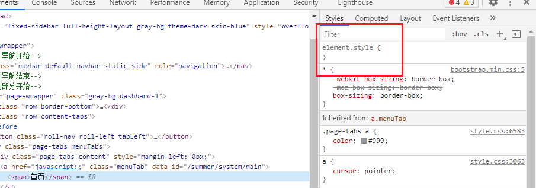

# CSS基础

简单来说 CSS 是描述 HTML 长什么样的。

## k-v style

```plain
width: 100%;
font-family: "Lato", sans-serif;
margin: 10px;
padding: 40px;
color: #007020;
```

可以通过 <kbd>F12</kbd> 对 `element.style` 进行修改



常见的键有：

    {max-,min-,}{height,width}
    background{,-color,-image,-repeat}
    {border,margin,padding}{,-color,-image,-left,-right,-top,-bottom}
    color
    display
    font{,-family,-size}

## 将 CSS 附加到 HTML 节点上

### 内联样式

```html
<p style="color: red;">Hello, I'm red!</p>
```

### 选择器

#### ID 选择器

```css
#demo {
  border: red 2px solid;
}
```

```html
<p>Normal</p>
<p id="demo">Demo</p>
```

#### 类选择器

```css
.demo {
  border: red 2px solid;
}
```

```html
<p>Normal</p>
<p class="demo">Demo 1</p>
<p class="demo">Demo 2</p>
```

#### 类型选择器

```css
h1 {
  color: red;
}
```

```html
<h1>h1</h1>
<h2>h2</h2>
<h3>h3</h3>
```

##### 类型选择器+属性选择器

Only make https://baidu.com red

```css
a {
  color: blue;
}
a[href="https://baidu.com"] {
  color: red;
}
```

#### 选择器组合

<!-- https://developer.mozilla.org/en-US/docs/Web/CSS/Reference#selectors -->

```css
A, B {

}

A B {

}

A > B {

}
```

# Flex 布局
