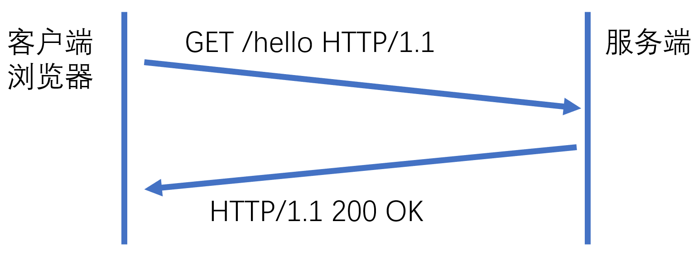
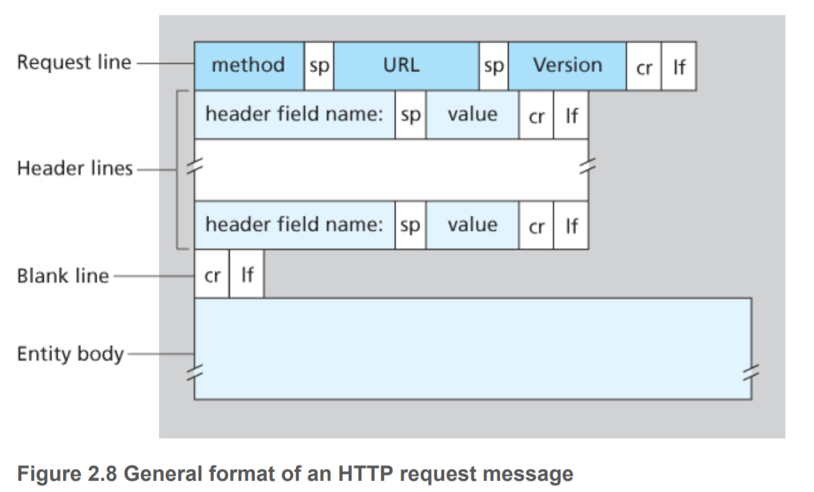
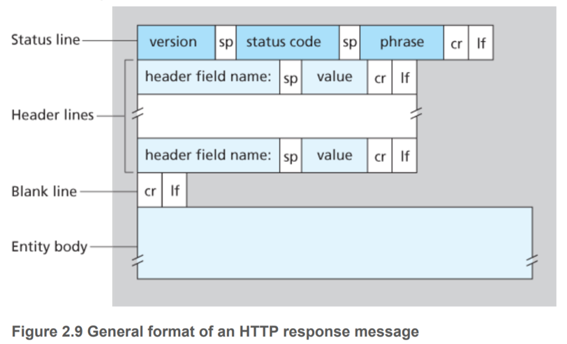

# 与服务器的通信

HTML, CSS, JavaScript 都需要通过 HTTP 协议传输。



## 请求

HTTP 请求格式为

```plain
方法 路径 HTTP/版本号
请求头

请求内容
```



### GET

```plain
GET /path/to/image.png HTTP/1.1
Host: example.com
Accept: */*
User-Agent: curl/7.64.0

```

### POST

```plain
POST / HTTP/2
Host: fars.ee
User-Agent: curl/7.64.0
Accept: */*
Content-Length: 156
Content-Type: multipart/form-data; boundary=------------------------818b9d71f37a4037

（数据）
```

## 响应

HTTP 响应格式为

```plain
HTTP/版本号 状态码 状态信息
响应头

响应体
```



### 状态码

最常见的状态码与对应状态信息如下：

#### 2xx 成功响应

    200 OK
    204 No Content
    206 Partial Content

#### 3xx 重定向

    301 Moved Permanently
    302 Found
    304 Not Modified
    307 Temporary Redirect

#### 4xx 客户端响应

    400 Bad Request
    401 Unauthorized
    403 Forbidden
    404 Not Found
    418 I'm a teapot
    451 Unavailable For Legal Reasons

#### 5xx 服务端响应

    500 Internal Server Error
    501 Not Implemented
    502 Bad Gateway
    503 Service Unavailable
    504 Gateway Timeout
