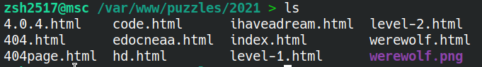

[toc]

# 在地址栏按下回车后发生了什么

这是一个经典的面试题，为什么说经典，因为不仅涉及到的东西很全，而且从不同的角度都可以有侧重点（比如硬件、浏览器、网络、系统等多个层次，每个层次都可以详细的展开解释）

这次的侧重点是 HTTP

curl 是一个命令行工具，可以用来发起 HTTP 请求，为了方便展示，这里用 curl （win10 的话，cmd 下面的 curl 也可以，但是 powershell 里面的 curl 是 `Invoke-WebRequest` 命令的一个 alias，并不一样。

（可以跟着一个 wireshark 的例子，不过主要是 curl） 

## DNS 服务，域名的解析

### IP 与域名

ip 地址是一串数字（ipv4 是 4 个 0~255 的数字，而 ipv6 是 8 组，每组 4 个十六进制数字）

ipv4: `127.0.0.1`
ipv6: `2001:0db8:86a3:08d3:1319:8a2e:0370:7344`

域名

domain: example.com
domain: sub.example.com
domain: a.b.c.example.com

**一般来说**

ip 实际的标识了一个设备的地址，根据 ip 可以确定一个具体的设备，而 域名 则是一种符号名称，用来表示一个实际的站点。

ip 的话，确切的定位到了一个设备，也存在缺陷，比如难以记忆，以及一个设备一般来说能拿到的 ip 只有为数不多的几个，有的时候可能有大量网站的需求。

而域名，则是通过更为人性化的符号记录（解析）到了特定的 ip 上。而且同一个物理设备可以添加多个域名，并且每个站点作出不同的解析

### DNS 的作用

域名系统（英语：Domain Name System，缩写：DNS）是互联网的一项服务。

一般而言，用于将域名解析到 IP （ipv4: A 记录，ipv6: AAAA 记录）或者另一个域名（CNAME 记录）

对于自己解析到自己这种操作，可以试试 `recursive.zsh2517.com` （CNAME -> `recursive.zsh2517.com`）
或者这三个 CNAME 解析 `recursive1.zsh2517.com` -> `recursive2.zsh2517.com` -> `recursive3.zsh2517.com` -> `recursive1.zsh2517.com` -> ......

一般会递归到一定层数后失败，或者是直接返回 servfail

一个域名可以同时对应多个 IP（可以同时是 ipv4 ipv6），相同（4/6）的一般是用于负载均衡（多个服务器同时分担一个网站的请求），而 ipv4 ipv6 个同时存在更多的是为了适配两种协议（具体选哪个取决于客户端）

### nslookup 查询

nslookup 是一个命令行工具，可以进行 DNS 查询。比如

| 域名                | 类别             |
|---------------------|------------------|
| zsh.xyz             | 仅有一条 A  记录 |
| mirrors.hit.edu.cn  | A + AAAA         |
| mirrors4.hit.edu.cn | A                |
| mirrors6.hit.edu.cn | AAAA             |
| www.baidu.com       | CNAME            |
| github.io           | 多个 A           |

`zsh.xyz`
```shell
zsh2517@~ > nslookup zsh.xyz
Server:         127.0.0.53
Address:        127.0.0.53#53

Non-authoritative answer:
Name:   zsh.xyz
Address: 172.17.34.50
```

`mirrors.hit.edu.cn`
```shell
zsh2517@~ > nslookup mirrors.hit.edu.cn
Server:         127.0.0.53
Address:        127.0.0.53#53

Non-authoritative answer:
Name:   mirrors.hit.edu.cn
Address: 202.118.254.110
Name:   mirrors.hit.edu.cn
Address: 2001:da8:b800:253::aa0:41f
```

`mirrors4.hit.edu.cn`
```shell
zsh2517@~ > nslookup mirrors4.hit.edu.cn
Server:         127.0.0.53
Address:        127.0.0.53#53

Non-authoritative answer:
Name:   mirrors4.hit.edu.cn
Address: 202.118.254.110
```

`mirrors6.hit.edu.cn`
```shell
zsh2517@~ > nslookup mirrors6.hit.edu.cn
Server:         127.0.0.53

Address:        127.0.0.53#53
Non-authoritative answer:
Name:   mirrors6.hit.edu.cn
Address: 2001:da8:b800:253::aa0:41f
```

`www.baidu.com`
```shell
zsh2517@~ > nslookup www.baidu.com
Server:         127.0.0.53
Address:        127.0.0.53#53

Non-authoritative answer:
www.baidu.com   canonical name = www.a.shifen.com.
Name:   www.a.shifen.com
Address: 39.156.66.18
Name:   www.a.shifen.com
Address: 39.156.66.14
```

`github.io`
```shell
zsh2517@~ > nslookup github.io 
Server:         127.0.0.53
Address:        127.0.0.53#53

Non-authoritative answer:
Name:   github.io
Address: 185.199.110.153
Name:   github.io
Address: 185.199.109.153
Name:   github.io
Address: 185.199.108.153
Name:   github.io
Address: 185.199.111.153
```

### hosts

hosts 是本地的一个文件。记录了静态的 域名与 IP 的映射关系。

对于 windows，其位置为 `C:\windows\system32\drivers\etc\hosts`

对于 Linux，其位置为 `/etc/hosts`

 

```
127.0.0.1 test.com
219.217.227.93 mscpuzzle
192.168.31.1 router
```

## HTTP 请求的发送

### 需要发送哪些内容

比如用浏览器打开 zsh.xyz

| 类别       | 值      |
|----------|:--------|
| 请求方式   | GET     |
| 域名（站点） | zsh.xyz |

### IP 和端口

IP 是描述设备的，但是一个设备上一般情况下不会只有一个服务（比如一个设备可能同时负责了 HTTP 服务、邮件服务、文件服务等等众多服务）

这个时候，就需要端口区分了。端口是个虚拟的概念（不对应什么物理的设备），一般使用是从 1 到 65535

### HTTP 请求报文

结构是

```
请求方式 目录 HTTP
HTTP请求头

Payload（对于比如 POST 请求，发送的数据在这里。不同的 Content-Type 标识了不同的存储方式）
```

请求方式如 GET POST 等

```
GET / HTTP/1.1
Host: zsh.xyz
User-Agent: curl/7.68.0
Accept: */*

```

```
GET / HTTP/1.1
Host: zsh.xyz
Connection: keep-alive
Cache-Control: max-age=0
DNT: 1
Upgrade-Insecure-Requests: 1
User-Agent: Mozilla/5.0 (X11; Linux x86_64) AppleWebKit/537.36 (KHTML, like Gecko) Chrome/90.0.4430.212 Safari/537.36
Accept: text/html,application/xhtml+xml,application/xml;q=0.9,image/avif,image/webp,image/apng,*/*;q=0.8,application/signed-exchange;v=b3;q=0.9
Accept-Encoding: gzip, deflate
Accept-Language: zh-CN,zh;q=0.9

```

## 服务器的处理

### 一个服务器上未必只有一个域名

服务器收到客户端发过来的报文后，会对其进行解析。

其中，HTTP 请求头的 HOST 字段，描述了访问的哪个站点。

例如虽然 zsh.xyz, 172.17.34.50.nip.io, 172.17.34.50 均指向了同一个设备，但是内容不同。

### 对于静态站点

将 URL 路径转换成文件路径

`http://msc.hit.edu.cn/puzzles/2021/` <==> `/var/www/puzzles/2021/`



`http://msc.hit.edu.cn/puzzles/2021/level-1.html`

`/var/www/puzzles/2021/level-1.html`

**缺省文件**

很多时候，URL 里面不跟随具体文件名，比如

`https://zsh2517.com/` --> `https://zsh2517.com/index.html`
`https://blog.zsh2517.com/` --> `https://blog.zsh2517.com/index.php`

一般情况下是 `index`/`default` + `.` +  `html`/`htm`/`php`/`asp`/`aspx`/`jsp`

### 对于动态站点

前面提到了，即使是对于静态站点，也是有一个 **服务端** 的参与。这个服务端解析 HTTP 报文，并且返回对应的文件。

既然 HTTP 报文是由一个 **服务器** 处理的，然后根据报文 **返回了指定的文件**

那么，这个服务器就可以不单纯接收报文、返回指定文件，同样可以干别的。

对于动态站点来说，这个 **服务器** 不仅仅是单纯解析这个 HTTP 报文，而是同时做出一些操作。

举个例子

假设有这样一个网站， `calc.example.com` 

```
http://calc.example.com/setarg1/12 // 设置第 1 个加数为 12
http://calc.example.com/setarg2/34 // 设置第 2 个加数为 34
http://calc.example.com/setOpe/add  // 设置操作符为加号
http://calc.example.com/getVal // 获取结果
```

一个后端的程序接管（代替）了上述的 HTTP 响应（返回文件）的方式。

收到 /setarg1/12 的时候，不是返回 path/setarg1/12/index.html 而是存储一个值 12

### 模板语言

上面提到了，这个页面不一定是确定的某个文件，那么可以不可以返回文件呢？显然可以，而且这个返回是动态的

```html
<!DOCTYPE html>
<html lang="en">
<head>
    <meta charset="UTF-8">
    <title>Document</title>
</head>
<body>
    <b>Now is {{time}}</b> 
</body>
</html>
```

然后，在后端编写程序，当需要返回这个文件的时候，先做一下处理，然后再返回。比如

```
import datetime
file = open("time.html", "r", encoding="utf8")
text = file.read()
text = text.replace("{{time}}", datetime.datetime.strftime(datetime.datetime.now(), "%D %T"))
send(text)
```

### asp 与 PHP

既然可以像模板语言一样，写 HTML 的时候，指定模板区域，那么能不能直接把逻辑和页面写到一块呢？

HTML 的本质是文本文件，那么只要动态的生成 HTML 页面代码，就可以在前端渲染出来各种内容了

可以是任意的支持网络操作的语言拼接出 HTML

也可以是比如 PHP, ASP 等语言，通过 `<?php ?>` 的方式嵌入脚本。

比如 

```php
1 + 2 = 
<?php
echo 1 + 2;
?>
```

### 对于 API

其实，最开始的那个例子就是 API 的例子。（API 一般就是指各种接口，通常是一个主体提供 API 供另一个主体使用）

现在已经知道了，一个 HTTP 服务器，所有收到的东西都是可控的

那么，比如 添加一个用户、删除一个用户可以怎么描述呢？

```
GET http://test.com/user/add?username=admin&password=admin
GET http://test.com/user/delete?username=admin

GET http://test.com/user/add/admin/admin
GET http://test.com/user/delete/admin

POST http://test.com/user/add    payload: username=admin&password=admin
POST http://test.com/user/delete    payload: username=admin

POST http://test.com/user    payload: operation=add&username=admin&password=admin
POST http://test.com/user    payload: operation=delete&username=admin
```

请求方法 - Method

GET / POST

二者是最常见的请求，但是实际上不止这两种。比如还有 put patch delete head options 等。

REST 原则：URL 里面不体现动词，操作用 Methods 描述。

比如上面的可以写成

```
POST http://test.com/user    payload: username=admin&password=admin
DELETE http://test.com/user    payload: username=admin
```

数据类型 - Content-Type

对于尤其是 post，其数据存在多样性。比如可能是文本，可能是HTML，可能是媒体文件（图像、视频、音频）、可能是结构化数据（XML/JSON）

Content-Type 这里指定了发送数据的类型

比如表单 `multipart/form-data`

```
POST /foo HTTP/1.1
Content-Length: 68137
Content-Type: multipart/form-data; boundary=---------------------------974767299852498929531610575

---------------------------974767299852498929531610575
Content-Disposition: form-data; name="description"

some text
---------------------------974767299852498929531610575
Content-Disposition: form-data; name="myFile"; filename="foo.txt"
Content-Type: text/plain

(content of the uploaded file foo.txt)
---------------------------974767299852498929531610575
```


URL编码 `application/x-www-form-urlencoded`

```
POST http://www.example.com HTTP/1.1
Content-Type: application/x-www-form-urlencoded;charset=utf-8
title=test&sub%5B%5D=1&sub%5B%5D=2&sub%5B%5D=3
```

JSON 数据 `application/json`

```
POST http://www.example.com HTTP/1.1
Content-Type: application/json;charset=utf-8
{"title":"test","sub":[1,2,3]}
```

## HTTP 响应的返回

前面提到了，HTTP 是通过纯文本的形式进行交互的。返回的格式也是纯文本。比如

```
HTTP/ver status_code status_message
Resp Headers

body（content）
```


### HTTP 响应报文

```
HTTP/1.1 200 OK
Server: nginx/1.18.0 (Ubuntu)
Date: Mon, 24 May 2021 09:00:13 GMT
Content-Type: text/html
Transfer-Encoding: chunked
Connection: keep-alive
Content-Encoding: gzip

<html>
<head><title>Index of /</title></head>
<body>
<h1>Index of /</h1><hr><pre><a href="../">../</a>
<a href="1/">1/</a>                                                 06-May-2021 02:30                   -
<a href="2/">2/</a>                                                 16-May-2021 11:01                   -
<a href="3/">3/</a>                                                 22-May-2021 08:29                   -
<a href="4/">4/</a>                                                 22-May-2021 12:17                   -
<a href="6/">6/</a>                                                 07-May-2021 11:44                   -
</pre><hr></body>
</html>
```

## 请求其他内容

### 输入完 URL 按下回车之后，会发起对于页面的请求


### 由网页发起

比如 `<link rel="stylesheet" href="">`, `<script src="" type="text/javascript">`, `<iframe src="https://example.com">` 等

### 由脚本发起

比如 XMLHttpRequest （或各种被封装过的 HTTP 接口，比如 `$.post`/`$.get` 等）

# web 前后端

## 静态网页、动态网页与伪静态

重新展开介绍静态站点动态站点等

## 前后端的新趋势

### 前端框架 - 将页面交给 JS 进行处理

vue/react 等站点，可能第一步加载出来的 HTML 就几行，然后后面一堆 js
之后也翻不到页面是如何更新的（页面更新并没有HTTP加载）

### 前后端分离 - 数据和页面相互分离

比如 vue/react 或者普通的 jQuery 站，页面数据是可以不跟随页面一起加载的
这也是为什么比如网页加载出来有空白

# 广义的前后端

未必是真的这么分类。只是说相关技术并没有真的应用到网页里面

## 采用 HTTP 协议进行交互的应用程序

即使是原生应用（或者各种平台应用）也可以按照 HTTP 协议与服务器进行交互
不需要自己重新实现协议，而且可以使用的工具很多

## 监听和触发

服务器作为一个长时间等待连接的监听的角色

客户端作为一个可以主动发出信息的触发器

比如 方糖(`scft.qq.com`)

长轮询、短轮询、长连接
